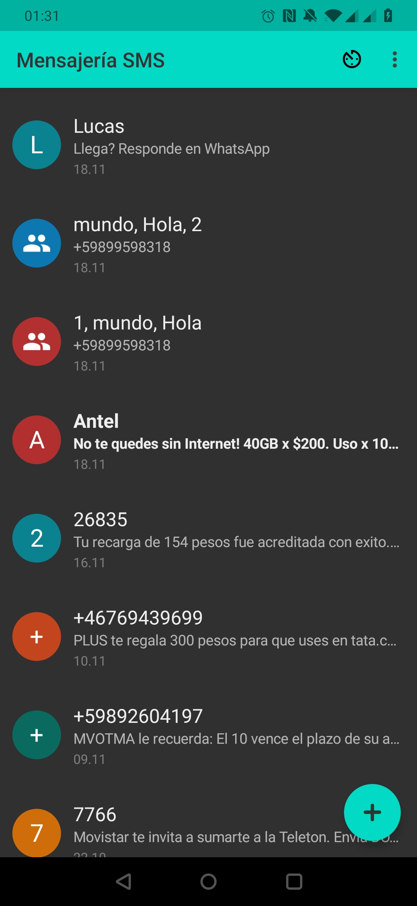
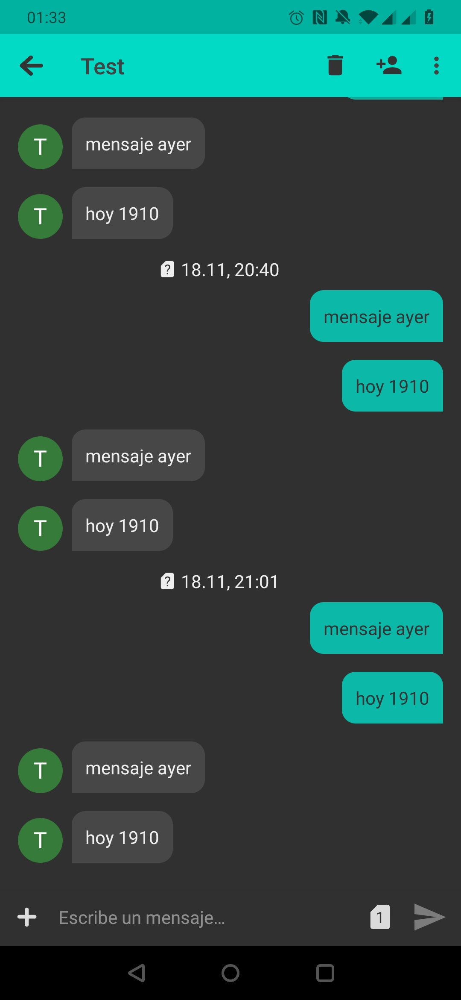

# SMS Gateway
Messaging application that turns an android phone into a gateway for sending SMS.
Application based on [Simple-SMS-Messenger](https://github.com/SimpleMobileTools/Simple-SMS-Messenger)

## Initialization
Install the application, go to settings and configure the url where messages are consulted.
In case the service requires authentication, complete the Authorization field.

## Behaviour
The app periodically makes a post to the service with a body as follows
```json
```json
[ 
	{ id:number, status:string, resultCode: number},
	...
]
```
Status can take the values: SENT and ERROR.
ResultCode can take the values of [SmsManager](https://developer.android.com/reference/android/telephony/SmsManager).
Note that status sent does not mean that the message has been sent correctly, for this you need resultCode (for message sent successfully resultCode = -1)

The application expects a response in the following format
```json
[ 
	{ id:number, phoneNumber: String, body : String, scheduledDate: Date},
	....
]
```

The message will be sent automatically on the date specified by scheduledDate.
The application does not have a retry policy, this logic is delegated to the server, if you want to retry send a message already sent, add that message to the response again


##  Considerations
Mobile operating systems are not designed to be periodically executing tasks in the background, so it is not reliable if the user does not use the app.

To send the messages, the following actions are carried out
- alarms are scheduled with alarmManager at the exact execution date marked by the message
- workManager is used to schedule message synchronization jobs and send messages not sent by alarmManager
- firebase is used to start syncing remotely 1 time per day


##  Screenshots
<p float="left">




